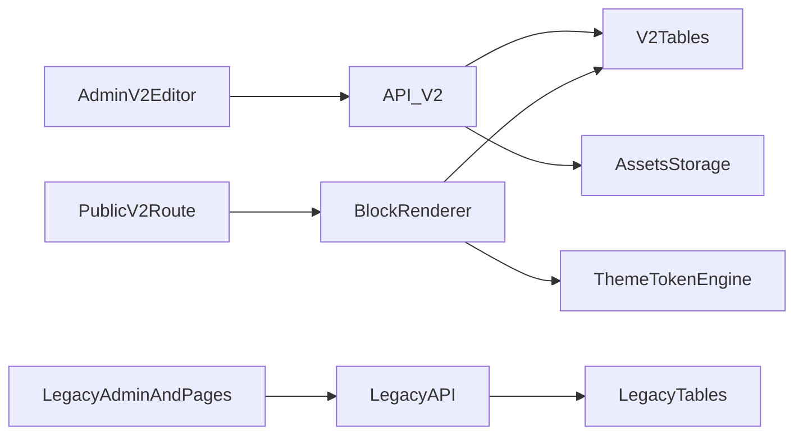

# CMS V2 Architecture

## High-Level Design

V2 is a parallel architecture that introduces a block engine while preserving legacy runtime and data paths.



## Core Principles

- Parallel-first: no destructive rewrite of legacy paths.
- Block contract first: renderer and editor depend on stable block schemas.
- Versioned content: drafts and publishes are explicit snapshots.
- Deterministic migration: same legacy input always produces same V2 output.
- Theme tokens, not hardcoded semantics: styling is data-driven.

## Runtime Components

- V2 Admin UI
  - Page list/create/edit
  - Block canvas and inspector
  - Theme panel
  - Publish panel
- V2 Public Renderer
  - Reads published version
  - Resolves block registry by `block.type`
- V2 API Layer
  - CRUD, draft, publish, migration preview
  - Validation and permission checks
- V2 Persistence Layer
  - Pages, versions, themes, optional normalized blocks

## Block Rendering Contract

Each block follows this structure:

```json
{
  "id": "blk_header_01",
  "type": "header",
  "visibility": true,
  "styleVariant": "default",
  "props": {}
}
```

## Recommended Block Registry

```ts
const blockRegistry = {
  header: HeaderBlock,
  richText: RichTextBlock,
  peopleList: PeopleListBlock,
  imageGrid: ImageGridBlock,
  cta: CtaBlock,
  footer: FooterBlock,
  image: ImageBlock,
  authorCard: AuthorCardBlock,
  audio: AudioBlock,
};
```

## Permissions Model (MVP)

- Reuse current JWT middleware and roles.
- Admin:
  - Full V2 CRUD/publish/migration actions.
- Editor:
  - Edit assigned pages only.
  - Publish behavior can be restricted to Admin if needed.

## Failure and Recovery Notes

- Draft save failure must not affect last published version.
- Publish action should be atomic at version pointer level.
- Migration preview must be read-only and side-effect free.
