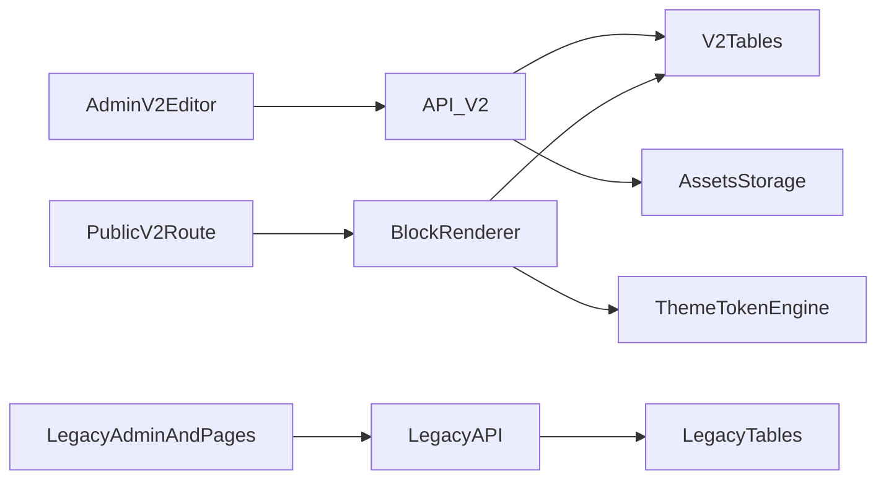

# CMS V2 Master Specification

## 1) Executive Summary

CMS V2 transforms the current project from a graduation-focused content system into a general-purpose, reusable page builder.  
The approach is a safe parallel rollout: keep legacy pages stable while introducing a V2 block engine, V2 APIs, and V2 editor.

## 2) Objectives

- Support multiple page purposes beyond graduation.
- Remove domain-specific coupling from schema and renderer logic.
- Introduce reusable section blocks and theme presets.
- Add draft/publish content workflow.
- Migrate legacy content deterministically and safely.

## 3) Scope (MVP)

- Header block
- Rich text block
- People list block
- Image grid block
- CTA block
- Footer block
- Theme/style presets
- Draft/Publish workflow
- Admin/Editor roles

## 4) Non-Goals (MVP)

- Full plugin ecosystem
- Multi-tenant enterprise permission model
- Real-time collaborative editing
- Immediate legacy shutdown

## 5) Parallel Architecture



Key rule: V2 is additive first. Legacy remains active until V2 parity is proven.

## 6) V2 Data Model

### `v2_pages`

- `id`, `slug`, `title`, `status`, `theme_id`, `published_version_id`
- timestamps: `created_at`, `updated_at`, `published_at`

### `v2_page_versions`

- `id`, `page_id`, `version_no`, `content_json`, `created_by`, `created_at`, `is_published`

### `v2_themes`

- `id`, `name`, `tokens_json`, timestamps

### Optional `v2_blocks`

- normalized block persistence if chosen (not required when `content_json` is source-of-truth)

### Keep legacy tables unchanged (initially)

- `posts_content`, `page_labels`, `pages`, `tokens`, `users`, `page_assignments`, `footer_config`

## 7) Block Contract

```json
{
  "id": "blk_header_01",
  "type": "header",
  "visibility": true,
  "styleVariant": "default",
  "props": {}
}
```

Recommended registry:

- `header`
- `richText`
- `peopleList`
- `imageGrid`
- `cta`
- `footer`
- (supporting) `image`, `authorCard`, `audio`

## 8) Neutral Content Semantics

Replace domain words in core schemas:

- `teacher` -> `author`
- `students/guests` -> `people`
- `class` -> `group`
- `batch/date/location` -> generic metadata fields

Domain wording is stored in labels/template defaults, not in runtime schema.

## 9) Labels Strategy

- Labels live in page data (`page.labels`) and can be overridden per page.
- Templates only provide defaults.
- No hardcoded graduation-specific labels in V2 renderer logic.

Example:

```json
{
  "labels": {
    "headerTitleLabel": "Event",
    "peopleListTitle": "Team Members",
    "peopleTagText": "Lead",
    "authorLabel": "Speaker"
  }
}
```

## 10) V2 API Contract (MVP)

Base prefix: `/api/v2`

- `GET /api/v2/pages`
- `POST /api/v2/pages`
- `GET /api/v2/pages/:id`
- `PUT /api/v2/pages/:id/draft`
- `POST /api/v2/pages/:id/publish`
- `GET /api/v2/public/:slug`
- `POST /api/v2/migration/preview/:legacyPageId`

Error format:

```json
{
  "error": "Validation failed",
  "code": "VALIDATION_ERROR",
  "details": {}
}
```

## 11) Auth and Permissions

Reuse current JWT middleware and role checks.

- Admin: full V2 access including publish and migration.
- Editor: assigned pages only (publish can be admin-only).

## 12) Legacy-to-V2 Mapping

Core mappings:

- `section_name` -> `header.title`
- `quote` -> `header.subtitle`
- `batch` -> `header.metaLeft`
- `location` -> `header.metaRight`
- `class_photo` -> `image.src`
- `gallery` -> `imageGrid.images[]`
- `teacher_message` -> `richText.content`
- `teacher_name/title/photo` -> `authorCard`
- `teacher_audio/transcript` -> `audio`
- `students[]` -> `peopleList.items[]`
- `together_since` -> `peopleList.footerText`
- `footer_config.*` -> `footer.props.*`
- `page_labels.*` -> `page.labels`
- `section_visibility` -> block `visibility`
- `color_theme` -> `page.theme.preset`

## 13) Deterministic Migration Rules

- Same legacy input must always produce identical V2 JSON.
- Preserve rich text HTML as-is; sanitize at render time.
- Hidden legacy sections become `visibility: false` blocks (not dropped).
- Keep labels verbatim during migration; editorial cleanup can happen later.

## 14) Rollout Phases

1. Foundation: schema, contracts, V2 APIs, draft/publish.
2. Frontend shell: V2 renderer and editor scaffold.
3. Block editors: add/reorder/edit/remove block UX.
4. Migration pilot: preview then controlled writes.
5. Cutover: default new pages to V2, legacy stays readable until retirement window closes.

## 15) Phase 1 (1 Week) Checklist

- Day 1: finalize storage/contracts/schema validation
- Day 2: DB migrations and indexes
- Day 3: V2 CRUD APIs
- Day 4: publish + public read path
- Day 5: migration preview endpoint
- Day 6: integration tests + pilot gate checks
- Day 7: hardening + contract freeze

## 16) Risks and Mitigations

- Migration inconsistency -> deterministic adapter + schema validation
- Scope creep -> freeze MVP block set before UI polish
- Renderer drift -> single block schema source of truth
- Legacy regressions -> keep old runtime untouched through pilot

## 17) Acceptance Criteria

- Can create/reorder/edit MVP blocks in V2 editor.
- Draft and publish versions are separate and reliable.
- Public route serves published content only.
- Auth/roles are enforced for V2 routes.
- At least one real legacy page migrates with acceptable parity.
- Legacy system remains fully operational during rollout.

## 18) Document Map

- [V2_OVERVIEW.md](./V2_OVERVIEW.md)
- [V2_ARCHITECTURE.md](./V2_ARCHITECTURE.md)
- [V2_DATA_MODEL.md](./V2_DATA_MODEL.md)
- [V2_CONTENT_MODEL.md](./V2_CONTENT_MODEL.md)
- [V2_API_SPEC.md](./V2_API_SPEC.md)
- [V2_MIGRATION.md](./V2_MIGRATION.md)
- [V2_IMPLEMENTATION_PLAN.md](./V2_IMPLEMENTATION_PLAN.md)

## 19) Pre-Implementation Recommendations

### 19.1 Schema Governance

- Create a schema package folder (recommended `docs/v2-schemas/`) with:
  - one JSON schema per block type
  - one page-level schema (`v2-page.schema.json`)
- Treat schemas as source-of-truth for both API validation and editor form generation.
- Add schema versioning (`schemaVersion`) in page content JSON for future compatibility.

### 19.2 Content and Security Policy

- Define and document allowed HTML tags/attributes for rich text blocks.
- Standardize sanitization points:
  - sanitize on render (required)
  - optional pre-validation on save
- Define link behavior policy:
  - external links require `rel="noopener noreferrer"`
- Confirm upload constraints:
  - max file sizes
  - max image dimensions
  - accepted MIME types

### 19.3 Template Catalog

- Create a template catalog doc with starter templates such as:
  - `generalLanding`
  - `eventPage`
  - `memoryPage`
  - `portfolioPage`
- For each template, define:
  - default block sequence
  - default labels
  - default theme preset

### 19.4 URL and Slug Policy

- Decide if slugs are immutable or editable.
- If editable, require redirect support/history table to avoid broken links.
- Reserve slug namespace rules early (length, charset, forbidden words).

### 19.5 Publish Governance

- Clarify publish permissions:
  - admin-only publish or editor publish with restrictions
- Define optional approval workflow for future extension.
- Add publish metadata support:
  - `publishedBy`
  - `publishNote`
  - `publishedAt`

### 19.6 Migration Parity QA Standard

- Add side-by-side parity checklist with:
  - screenshot comparison
  - text content equality checks
  - hidden/visible section parity
  - media path integrity checks
- Define an acceptable parity threshold before write-mode migration.

### 19.7 Observability and Auditability

- Add structured logs for V2 endpoints and migration preview failures.
- Track counters:
  - validation failures by block type
  - migration errors by rule
  - publish events
- Add audit trail for critical actions:
  - publish
  - migration write
  - restore-related operations

### 19.8 Backup Compatibility Strategy

- Decide when V2 tables enter backup payloads:
  - immediately in phase 1, or
  - after pilot stability
- Document restore precedence if both legacy and V2 are present.
- Verify backup/restore tests include mixed legacy+V2 datasets.

### 19.9 Legacy Deprecation Policy

- Define staged retirement gates:
  - freeze date (no new legacy pages)
  - read-only date (legacy editor locked)
  - final removal date (optional, after long stability period)
- Communicate criteria explicitly to avoid timeline drift.

### 19.10 Performance Budgets

- Define practical limits to keep V2 fast:
  - max blocks per page
  - max image count per grid
  - response payload size targets
  - public render latency targets
- Add warning indicators in editor before hard limits are reached.

## 20) Priority Matrix

## Must-Have Before Coding Starts

- Finalize V2 storage choice (versions-only JSON vs normalized blocks).
- Freeze block/page JSON schemas and validation rules.
- Define rich text sanitization and link security policy.
- Freeze slug policy (immutable vs editable with redirects).
- Freeze MVP API contracts for `/api/v2/*`.

## Must-Have Before Internal Pilot

- Implement structured logs for V2 API errors and migration preview failures.
- Define migration parity QA checklist and acceptance threshold.
- Define publish governance (who can publish, required metadata).
- Define backup compatibility behavior for mixed legacy + V2 datasets.
- Set performance guardrails (max blocks/media/payload targets).

## Must-Have Before Production Rollout

- Execute pilot migration on representative real pages with parity sign-off.
- Verify rollback playbook with at least one dry run.
- Enforce audit trail for publish and migration-write actions.
- Confirm legacy deprecation gates and communication plan.
- Run end-to-end tests for create/edit/draft/publish/public-render/migration paths.

## Nice-To-Have (After Stabilization)

- Template catalog expansion with more starter templates.
- Approval workflow extension (editor submits, admin approves).
- Advanced analytics dashboards for block-level usage and performance.
- Enhanced editor warnings and optimization tips for heavy pages.

## 21) Operational Excellence Recommendations

### 21.1 Architecture Decision Records (ADR)

- Add `docs/adr/` and document major decisions:
  - storage mode
  - slug policy
  - publish permissions
  - migration strategy
- Require new ADRs for decisions that change API/schema behavior.

### 21.2 Block Compatibility Policy

- Add compatibility metadata for each block schema:
  - `introducedIn`
  - `deprecatedIn` (optional)
  - migration guidance per version
- Guarantee older published pages keep rendering after schema evolution.

### 21.3 Feature Flag Strategy

- Gate V2 capabilities via flags:
  - V2 admin UI
  - V2 public rendering
  - V2 publish flow
  - migration write mode
- Support environment and role-based flag targeting.

### 21.4 Content Linting Before Publish

- Add pre-publish lint checks for common quality issues:
  - empty required headings
  - broken CTA links
  - missing image alt text
  - oversized image grids
  - empty people list items
- Mark checks as warning/error with clear author guidance.

### 21.5 Asset Lifecycle Policy

- Define:
  - page-scoped vs reusable assets
  - orphan file cleanup behavior
  - replace/rename semantics
  - retention rules for removed files
- Ensure backup/restore behavior aligns with asset policy.

### 21.6 Idempotency and Concurrency

- Add idempotency keys for draft save/publish endpoints where applicable.
- Define concurrent editing behavior:
  - optimistic locking/version conflict checks
  - merge policy or last-write-wins fallback

### 21.7 Test Matrix by Block Type

- Require baseline tests for every block:
  - schema validation
  - renderer output
  - editor form save/load
  - migration mapping compatibility
  - publish rendering integrity

### 21.8 Accessibility Baseline

- Enforce minimum a11y requirements:
  - heading hierarchy
  - keyboard navigation
  - image alt text
  - color contrast
  - focus states
- Include accessibility checks in publish linting and QA gate.

### 21.9 Phase Definition of Done

- Add a dedicated checklist per phase release gate:
  - required tests pass
  - docs updated
  - migration/rollback verified where relevant
  - observability metrics healthy

### 21.10 Documentation Ownership

- Assign ownership for each document class:
  - API spec
  - schema files
  - migration guide
  - implementation plan
- Require doc updates in same PR for contract or behavior changes.

### 21.11 Incident Support Playbook

- Define fast-response procedures for:
  - failed publish
  - broken migrated page
  - missing assets
  - schema validation outages
- Include rollback and communication templates.

## 22) Future-Proofing Recommendations

### 22.1 Plugin Boundary and Extension Model

- Define a formal extension boundary so custom block packs can register without changing core code.
- Require namespaced block type IDs (for example, `core/header`, `custom/testimonial`).
- Validate extension capabilities before runtime registration.

### 22.2 Marketplace Readiness Contract

- Standardize extension metadata:
  - package name
  - block types provided
  - schema versions
  - minimum platform version
- Add compatibility checks during extension load to prevent unsafe activation.

### 22.3 Internationalization (i18n)

- Design `labels` and block text to support locale variants from day one.
- Add optional locale field in page/version payloads.
- Keep fallback chain explicit (for example, `pageLocale -> defaultLocale`).

### 22.4 Scheduled Publishing

- Add scheduling fields:
  - `publishAt`
  - `unpublishAt` (optional)
- Define scheduler behavior for missed windows and timezone handling.

### 22.5 SEO Metadata in Core Model

- Add per-page SEO fields:
  - `metaTitle`
  - `metaDescription`
  - `ogImage`
  - `canonicalUrl`
  - `robots`
- Include validation and preview in editor workflow.

### 22.6 Global Sections

- Support reusable global sections (header/footer/banner) with page-level override capability.
- Version global sections independently and track dependent pages.

### 22.7 Version Diff and Review UX

- Provide draft-to-draft and draft-to-published diff view:
  - block order changes
  - block content changes
  - label/theme changes
- Improve publish confidence with explicit change summaries.

### 22.8 Secure Preview Links

- Add expiring signed preview URLs for stakeholders without admin access.
- Include scope restrictions and revocation support.

### 22.9 Product Analytics Hooks

- Add optional event hooks by block type:
  - render metrics
  - interaction metrics
  - conversion-related CTA metrics
- Keep analytics opt-in and privacy-aware.

### 22.10 Schema Migration CLI

- Build a migration CLI with:
  - dry-run mode
  - apply mode
  - rollback guidance
  - summary reports
- Use it for schema upgrades and block version migrations.

### 22.11 Reliability Targets (SLOs)

- Define service objectives for:
  - V2 API error rate
  - draft save/publish latency
  - public payload size and render latency
- Track SLOs in observability dashboards with alert thresholds.

### 22.12 Data Lifecycle and Privacy

- Define retention policy for:
  - deleted pages
  - assets
  - audit logs
- Clarify soft-delete vs hard-delete behavior and authorized roles.
